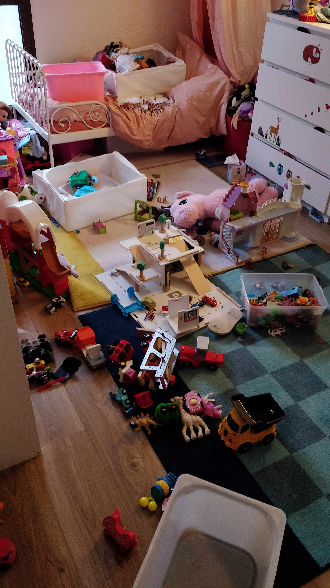
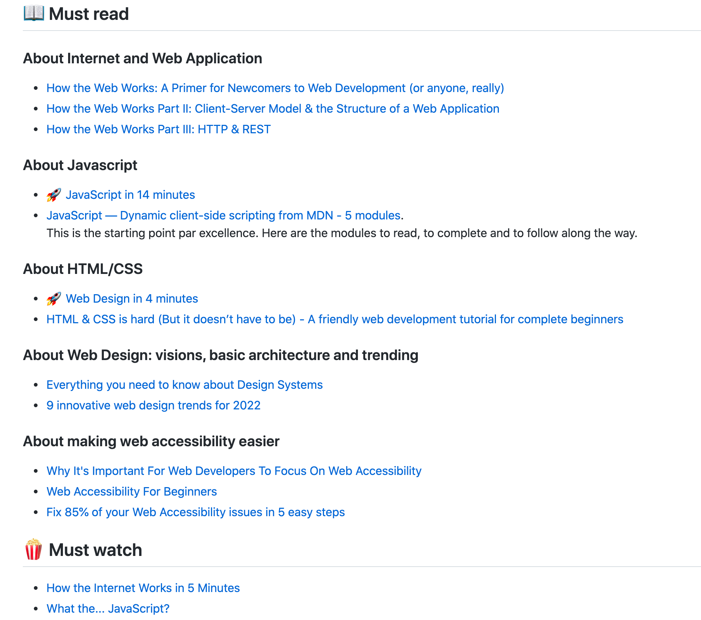

2016, 2017, 2018, 2019, ~~2020~~, 2021

---

<!-- .slide: data-background="#d8d8d6" -->

 <!-- .element height="50%" width="50%" -->

---

<!-- .slide: data-background="#d8d8d6" -->

 <!-- .element height="50%" width="50%" -->

---

YEEZY

---

350 v2

---

Hype sneakers

----

💰

Grey market

---

<!-- .slide: data-background="#d8d8d6" -->

---

220 $

---

350 $

---

<!-- .slide: data-background="#d8d8d6" -->

---

<!-- .slide: data-background="#d8d8d6" -->

---

200 $

---

475 $

---

<!-- .slide: data-background="#d8d8d6" -->

---

<!-- .slide: data-background="#d8d8d6" -->

---

160 $

---

310 $

---

<!-- .slide: data-background="#d8d8d6" -->

---

Profit

~ 555 $

---

5 minutes

---

<!-- .slide: data-background="#21232d" -->

6.6660 $ / hr

---

retail or under 📉

resell higher 📈

---

Niche 
autopilot

---

How?

---

<!-- .slide: data-background="#d8d8d6" -->

 <!-- .element height="50%" width="50%" -->

---

bots

🤖

---

tor, node.js, mongodb, redis, docker, kubernetes, elasticsearch...

---

---

3 common points

---

Web

---

Application

---

Architecture(s)

---

Web Application Architecture(s)

---

Web Application Architecture(s)

---

---

this workshop

===

💰

---

Yes and No

---

22 years ago

Esilv 1999

---

9 years

Former Lead Software Engineer

🛰️ Airbus

---

5 years

Director of Front-End Engineering

📲 Synthesio

---

1.5 years

Senior Engineering Manager

💳 PayFit

---

Coding for Money

---

* Android Apps
* Affiliation
* Bots
* iPhone re-selling
* t-shirts

---

92 Bond Street

---

Success Stories and Unicorn

---
~2008/2009

Uber, Airbnb, Snapchat, Dropbox, Spotify, Blabacar...

---

3 common points

---

Web Application Architecture(s)

---

Web

---

Internet ?

---

4.66 billions in Oct 2020

---

* Device consumer
* Internet connection
* Open a browser with a specific website address

---

Application

---

App

---

* Search on Google
* Send a message (Instagram, WhatsApp...)
* Buy the last bestseller on Amazon

---

* Drive with Waze
* Eat Otacos with uberEats
* Remote call with Zoom

---

Architecture

---

From URL

Click on "GO"

---

<!-- .slide: data-background="#d8d8d6" -->

---

(S)

---

n ways to build a webapp

---

JavaScript Ecosystem

---

Personal commitment and bias

---

1 language to rule them all 💍

---

The World Most Used Programming Language

---

The World Most Misunderstood Programming Language

---

🎯 Objective

---

Be able to start an online business with a web application

---

👩‍💻 + ⌨️ +️ 🖐🏽 🖐🏽

🏦

---

3 Months

3 Themes

---

🏁 Javascript World Domination

How JavaScript is eating the world.

---

🏗 Node.js, Master of Universe

How we can build a client and server application with the same language.

---

📡 Data is the new Gold

How to control your data to control your business.

---

GitHub

---

<a href="https://github.com/92bondstreet/javascript-empire" style="color:#fff">92bondstreet
/
javascript-empire</a>

---

yassine.azzout

@

gmail dot com

---

🎣 Methodology

---

Useful links in 3 parts

---

* 📖 Must Read
* 🍿 Must Watch
* 👩‍💻 Just tell me what to do

---

the 🚀 link

---

If you have just 30 minutes in your student busy life.

---

<!-- .slide: data-background="#d8d8d6" -->

---

📖 Must Read

Useful links to read as blog post

---

🍿 Must Watch

talk or podcast for passive context

---

👩‍💻 Just tell me what to do

To be ready the workshop day

---

[uncopyrighted](http://zenhabits.net/uncopyright)

---

Make 💵 if you want

---

5h / week

---

2h

---

2h / day

---

14h / week

⏳

---

1 project

Zero to Sold

---

Real-world problems

---

no othello, no tic-tac-toe ...

---

🚙 Check if a sold car on Leboncoin is a good deal

---

👨🏽‍🍳 Find all deals for 3-stars Michelin restaurant

---

🚘 Find SUV with the largest trunk

---

🏰 List the best rates for Relais & Châteaux with starred restaurants

---

🇫🇷 List Maître Restaurateur with Bib Gourmand distinction

---

...

---

~~Professor~~

---

No Marks

---

Become professional

---

Works

---

Works

Well

---

On-time

---

As expected

---

🤩

---

😑

---

😶

---

* 20 / 15 / 10
* 15 / 10 / 5
* 10 / 5 / 0

---

Slack for discussion

---

🎙Questions ?

A.M.A

---

🙏🏽 Thanks

---

github.com/92bondstreet

/

javascript-empire
