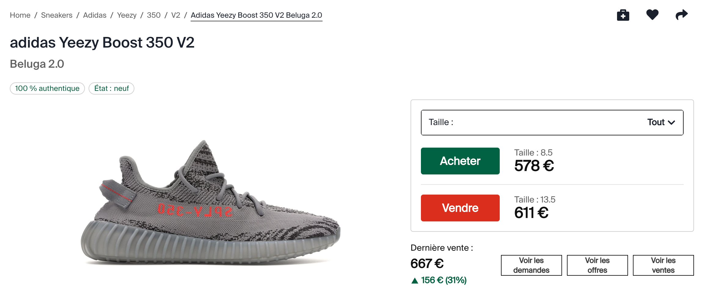
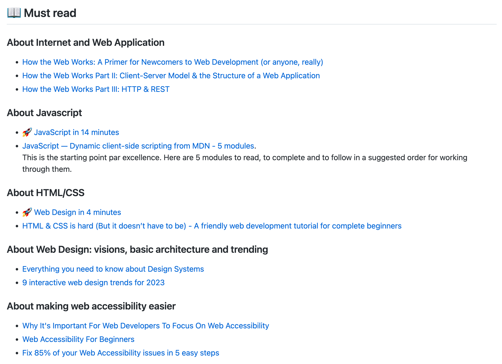

👟

---

YEEZY

---

350 v2

---

Hype sneakers

----

💰

Grey market

---

<!-- .slide: data-background="#d8d8d6" -->

---

220 $

---

350 $

---

<!-- .slide: data-background="#d8d8d6" -->

---

<!-- .slide: data-background="#d8d8d6" -->

---

200 $

---

475 $

---

<!-- .slide: data-background="#d8d8d6" -->

---

<!-- .slide: data-background="#d8d8d6" -->

---

160 $

---

310 $

---

<!-- .slide: data-background="#d8d8d6" -->

---

Profit

~ 555 $

---

5 minutes

---

<!-- .slide: data-background="#21232d" -->

6.6660 $ / hr

---

retail or under 📉

resell higher 📈

---

Niche

---

autopilot

---

How?

---

bots

🤖

---

clustering, high-frequency...

---

tor

---

node.js

---

mongodb

---

redis

---

docker

---

swarm

kubernetes

---

elasticsearch

---

logstash + kibana

---

---

3 common points

---

Web

---

Application

---

Architecture(s)

---

Web Application Architecture(s)

---

Web Application Architecture(s)

---

---

this workshop

===

💰

---

Yes and No

---

20

---

1999

* With Paul B.

---

9 years

Former Lead Software Engineer 🛰️ AIRBUS

---

5 years

Director of Front-End Engineering @synthesio

---

Coding for Money

---

92 Bond Street

---

* Android Apps
* Affiliation
* Bots
* iPhone re-selling
* t-shirts

---

92 Bond Street

---

Success Stories and Unicorn

---

Uber, Airbnb, Snapchat, Dropbox, Spotify, Blabacar...

---

3 common points

---

Web Application Architecture(s)

---

Web

---

Internet ?

---

7 billions in June 2017

---

* Device consumer
* Internet connection
* Open a browser with a specific website address

---

Application

---

App

---

* Search on google
* Send a message (Instagram, whatsapp...)
* Buy the last bestseller on Amazon

---

* Drive with waze
* Eat Otacos with uberEats

---

Architecture

---

types in a URL

---

click on "GO"

---

<!-- .slide: data-background="#d8d8d6" -->

---

(S)

---

n ways to build a webapp

---

Javascript Ecosystem

---

Personal commitment and bias

---

1 language to rule them all 💍

---

The World Most Used Programming Language

---

The World Most Misunderstood Programming Language

---

🎯 Objective

---

Be able to start an online business with a web application

---

👩‍💻 + ⌨️ +️ 🖐🏽 🖐🏽

🏦

---

9 courses

---

🏁 Javascript World Domination

---

🍭 Suit up your apps

---

🏄‍♀️ Node.js, Master of Universe

---

🖥️ React

---

🛠️ Toolbox and Productivity

---

🤺 3 Musketeers: RDD, CDD and TDD

---

📡 API-ness

---

📱 Progressive Web App, world of Hybrid

---

⭕ EcmaScript 2015 (ES6): the circle is now complete

---

Github

---

<a href="https://github.com/92bondstreet/javascript-empire" style="color:#fff">92bondstreet
/
javascript-empire</a>

---

yassine.azzout

@

gmail.com

---

🎣 Methodology

---

Useful links in 3 parts

---

* 📖 Must Read
* 🍿 Must Watch
* 👩‍💻 Just tell me what to do

---

the 🚀 link

---

If you have just 30 minutes in your student busy life.

---

<!-- .slide: data-background="#d8d8d6" -->

---

📖 Must Read

Useful links to read as blog post

---

🍿 Must Watch

talk or podcast for passive context

---

👩‍💻 Just tell me what to do

To be ready the workshop day

---

[uncopyrighted](http://zenhabits.net/uncopyright)

---

Make 💵 if you want

---

5h / week

---

2h

---

2h / day

---

14h / week

⏳

---

4 workshops

---

real-world problems

---

no othello, no tic-tac-toe ...

---

* check if a sold car on leboncoin is a good deal

---

* Find all deals for 3-stars Michelin restaurant

---

* Find SUV with the largest trunk
...

---

No marks

---

Become professional

---

Works

---

Works

Well

---

On-time

---

as expected

---

🤩

---

😑

---

😶

---

* 20 / 15 / 10
* 15 / 10 / 5
* 10 / 5 / 0

---

Discord, Slack... ?

---

Questions ?

---

Thanks
