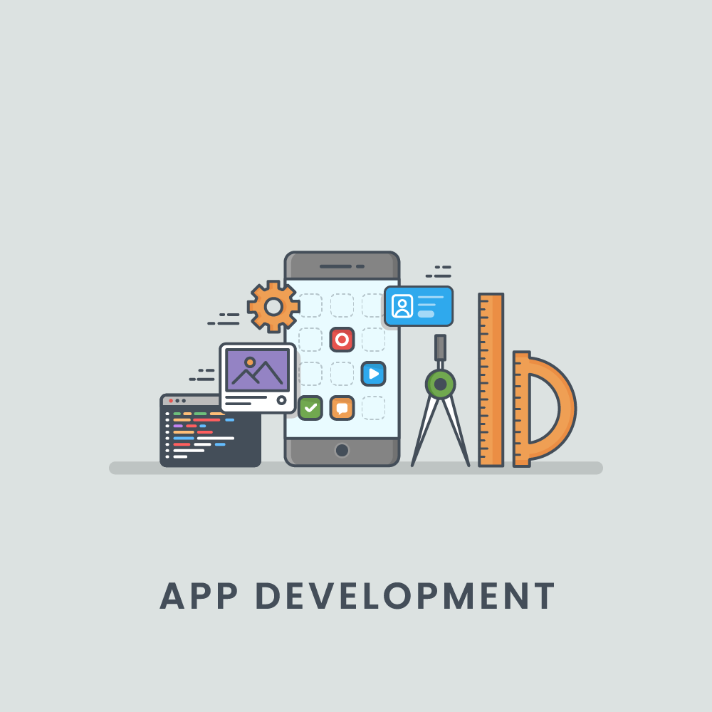

# Javascript Empire

> 2023 ESILV courses on Web Application Architecture(s)



<!-- START doctoc generated TOC please keep comment here to allow auto update -->
<!-- DON'T EDIT THIS SECTION, INSTEAD RE-RUN doctoc TO UPDATE -->
**Table of Contents**

- [🎯 Objective](#-objective)
- [🎣 Philosophy and Methodology](#-philosophy-and-methodology)
- [🛣️ The 3 Themes](#-the-3-themes)
- [👩‍💻 Just tell me what to do ... after this 3 months... for the next days, weeks, months ... even years](#%E2%80%8D-just-tell-me-what-to-do--after-this-3-months-for-the-next-days-weeks-months--even-years)
- [🌱 3 People to follow for inspiration](#-3-people-to-follow-for-inspiration)
- [📱 Workshops](#-workshops)
  - [Schedule for live workshops](#schedule-for-live-workshops)
- [Licence](#licence)

<!-- END doctoc generated TOC please keep comment here to allow auto update -->


## 🎯 Objective

```
Be able to start an online business with a web application.
```

## 🎣 Philosophy and Methodology

The idea of this course is **to embark you on the entrepreneurial journey to build your own web application to solve a real-world problem**.

I follow the **Industry best practices** with a 3-months-path with **1 dedicated theme by month**:

1. 🏁 **Theme 1 - Javascript World Domination**. How JavaScript is eating the world.
2. 🏗 **Theme 2 - Node.js, Master of Universe**. How we can build a client and server application with the same language.
3. 📡 **Theme 3 - Data is the new Gold**. How to control your data to control your business.

For each theme, I share a **collection of useful links** to deep diving in 3 parts:

* **📖 Must Read** - Useful links **to read as blog post** or github link.
* **🍿 Must Watch** - At least 1 talk or podcast link could help you **to learn in a passive or active context** (commuting, workout...).
* **👩🏽‍💻 Just tell me what to do** - **To be ready** for the month of the workshop days: links to tutorials to do, stuff to install...
* **The 🚀 link**. If you have just 30 minutes in your student busy life: **Read the 🚀 link**

I try to reach 14 hours of work by week (2h by day, Monday to Sunday).

## 🛣️ The 3 Themes

🏁 [Theme 1 - Javascript World Domination](./themes/1.md)

🏗 [Theme 2 - Node.js, Master of Universe](./themes/2.md)

📡 [Theme 3 - Data is the new Gold](./themes/3.md)

## 👩‍💻 Just tell me what to do ... after this 3 months... for the next days, weeks, months ... even years

Before to deep dive into the Javascript Ecosystem, **build a strong language understanding foundation**.
If you are ready to learn, the following links in this post [How to Learn ES6](https://medium.com/javascript-scene/how-to-learn-es6-47d9a1ac2620) are a good start.

For the new decade, take a look at some trends data with [Top JavaScript Frameworks and Tech Trends for 2021](https://medium.com/javascript-scene/top-javascript-frameworks-and-tech-trends-for-2021-d8cb0f7bda69).
Still valid for 2023.

Then you can **follow these awesome paths to become a Web developer**: [Developer Roadmaps - Step by step guides and paths to learn different tools or technologies](https://roadmap.sh/)

## 🌱 3 People to follow for inspiration

1. [Lydia Hallie](https://www.lydiahallie.io/) - [@lydiahallie](https://twitter.com/lydiahallie)
2. [Eric Elliot](https://medium.com/@_ericelliott) - [@_ericelliott](https://twitter.com/_ericelliott)
3. [Sindre Sorhus](https://sindresorhus.com) - [@sindresorhus](https://twitter.com/sindresorhus)

## 📱 Workshops

The workshops approach is **a comprehensive and actionable live sessions guide** through the different stages to bootstrap an online business with a web application.

We complete **1 project to solve a real-world problem** like to

1. 🚙 Check if a car sold on Leboncoin is a good deal
2. 👨🏽‍🍳 Find all TheFork deals for 3-stars Michelin restaurant
3. 🚘 Find SUV with the largest trunk
4. 🏰 List the best rates for Relais & Châteaux with starred restaurants
5. 🇫🇷 List Maître Restaurateur with Bib Gourmand distinction
6. ...


Today **the context is to understand what is the story behind each item of clothing you buy** with [Clear Fashion](https://github.com/92bondstreet/clear-fashion).

The workshops repository is available [here](https://github.com/92bondstreet/clear-fashion): [92bondstreet/clear-fashion](https://github.com/92bondstreet/clear-fashion)


### Schedule for live workshops

[Schedule](./SCHEDULE.md) for live workshops based on 10 days sessions.

## Licence

[Uncopyrighted](http://zenhabits.net/uncopyright/)
