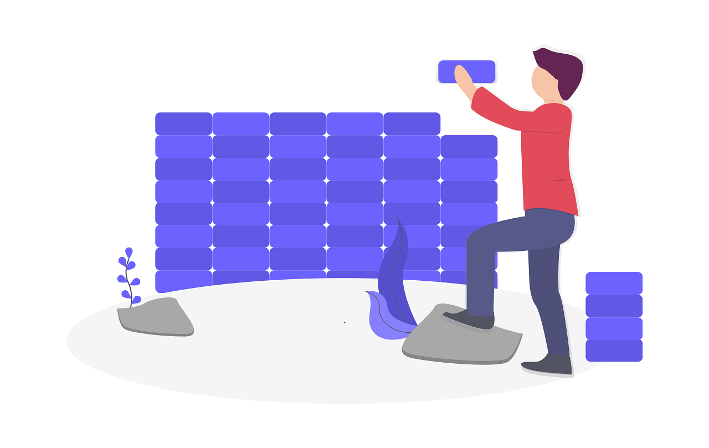

# Javascript Empire

> ESILV courses on Web Application Architecture(s)



<!-- START doctoc generated TOC please keep comment here to allow auto update -->
<!-- DON'T EDIT THIS SECTION, INSTEAD RE-RUN doctoc TO UPDATE -->
**Table of Contents**

- [🎯 Objective](#-objective)
- [🎣 Methodology](#-methodology)
  - [📖 Must Read](#-must-read)
  - [🍿 Must Watch](#-must-watch)
  - [👩 Just tell me what to do](#-just-tell-me-what-to-do)
- [🛣️ Courses](#-courses)
  - [🏁 Course 1 - Javascript World Domination](#-course-1---javascript-world-domination)
    - [📖 Must read](#-must-read)
      - [About Internet and Web Application](#about-internet-and-web-application)
      - [About Javascript](#about-javascript)
    - [🍿 Must watch](#-must-watch)
    - [👩‍💻 Just tell me what to do](#%E2%80%8D-just-tell-me-what-to-do)
  - [🍭 Course 2 - Suit up your apps](#-course-2---suit-up-your-apps)
    - [📖 Must read](#-must-read-1)
      - [About HTML/CSS](#about-htmlcss)
      - [About Web Design: visions, basic architecture and trending](#about-web-design-visions-basic-architecture-and-trending)
    - [🍿 Must watch](#-must-watch-1)
    - [👩‍💻 Just tell me what to do](#%E2%80%8D-just-tell-me-what-to-do-1)
  - [🏄‍♀️ Course 3 - Node.js, Master of Universe](#%E2%80%8D-course-3---nodejs-master-of-universe)
    - [📖 Must read](#-must-read-2)
    - [🍿 Must watch](#-must-watch-2)
    - [👩‍💻 Just tell me what to do](#%E2%80%8D-just-tell-me-what-to-do-2)
  - [🖥️ Course 4 - React](#-course-4---react)
    - [📖 Must read](#-must-read-3)
      - [The battle of frameworks](#the-battle-of-frameworks)
      - [About React](#about-react)
    - [🍿 Must watch](#-must-watch-3)
    - [👩‍💻 Just tell me what to do](#%E2%80%8D-just-tell-me-what-to-do-3)
  - [🛠️ Course 5 - Toolbox and Productivity](#-course-5---toolbox-and-productivity)
    - [📖 Must read](#-must-read-4)
      - [About productivity and methodology](#about-productivity-and-methodology)
      - [About tools and setup](#about-tools-and-setup)
      - [About Git and source code management](#about-git-and-source-code-management)
    - [🍿 Must watch](#-must-watch-4)
    - [👩‍💻 Just tell me what to do](#%E2%80%8D-just-tell-me-what-to-do-4)
  - [🤺 Course 6 - 3 Musketeers: RDD, CDD and TDD](#-course-6---3-musketeers-rdd-cdd-and-tdd)
    - [📖 Must read](#-must-read-5)
      - [About Readme-Driven Development](#about-readme-driven-development)
      - [About Comment-Driven Development](#about-comment-driven-development)
      - [About Test-Driven Development](#about-test-driven-development)
    - [🍿 Must watch](#-must-watch-5)
    - [👩‍💻 Just tell me what to do](#%E2%80%8D-just-tell-me-what-to-do-5)
  - [📡 Course 7 - API-ness](#-course-7---api-ness)
    - [📖 Must read](#-must-read-6)
      - [About Data and IA](#about-data-and-ia)
    - [About RESTful and GraphQL API](#about-restful-and-graphql-api)
    - [🍿 Must watch](#-must-watch-6)
    - [👩‍💻 Just tell me what to do](#%E2%80%8D-just-tell-me-what-to-do-6)
  - [📱 Course 8 - Make the Web accessible](#-course-8---make-the-web-accessible)
    - [📖 Must read](#-must-read-7)
    - [🍿 Must watch](#-must-watch-7)
    - [👩‍💻 Just tell me what to do](#%E2%80%8D-just-tell-me-what-to-do-7)
  - [⭕ Course 9 - EcmaScript 2015 (ES6): the circle is now complete](#-course-9---ecmascript-2015-es6-the-circle-is-now-complete)
    - [📖 Must read](#-must-read-8)
    - [🍿 Must watch](#-must-watch-8)
    - [👩‍💻 Just tell me what to do ... for the next days, weeks, months ... even years](#%E2%80%8D-just-tell-me-what-to-do--for-the-next-days-weeks-months--even-years)
- [📅 Schedule for live workshops](#-schedule-for-live-workshops)
- [Licence](#licence)

<!-- END doctoc generated TOC please keep comment here to allow auto update -->


## 🎯 Objective

```
Be able to start an online business with a web application.
```

## 🎣 Methodology

Before each workshop, I share some collection of useful links to deep diving on the current subject split in 3 parts. I try to limit to 14 hours of work by week (2h by day, Monday to Sunday).

* **📖 Must Read**
* **🍿 Must Watch**
* **👩 Just tell me what to do**
* the 🚀 link. If you have just 30 minutes in your student busy life: **Read the 🚀 link**

### 📖 Must Read

Useful links to read as blog post or github link.

### 🍿 Must Watch

At least 1 talk or podcast link could help you to learn in a passive context (commuting for instance) or when you do something else (workout).

### 👩 Just tell me what to do

To be ready the workshop day, links to tutorials, exercises to do...

## 🛣️ Courses

### 🏁 Course 1 - Javascript World Domination

#### 📖 Must read

##### About Internet and Web Application

-   [20 things I learned about browsers and the
    web](http://www.20thingsilearned.com/en-US/home)
-   [How the Web Works: A Primer for Newcomers to Web Development (or
    anyone,
    really)](https://www.freecodecamp.org/news/how-the-web-works-a-primer-for-newcomers-to-web-development-or-anyone-really-b4584e63585c/)
-   [How the Web Works Part II: Client-Server Model & the Structure of a
    Web
    Application](https://www.freecodecamp.org/news/how-the-web-works-part-ii-client-server-model-the-structure-of-a-web-application-735b4b6d76e3/#.e6tmj8112)

##### About Javascript

-   🚀 [JavaScript For Cats - An introduction for new
    programmers](http://jsforcats.com/)
-   [An introduction to Object-Oriented Programming in
    JavaScript](https://www.freecodecamp.org/news/an-introduction-to-object-oriented-programming-in-javascript-8900124e316a/)
-   [A re-introduction to
    JavaScript](https://developer.mozilla.org/en-US/docs/Web/JavaScript/A_re-introduction_to_JavaScript)

#### 🍿 Must watch

-   [How the Internet Works in 5
    Minutes](https://www.youtube.com/watch?v=7_LPdttKXPc)
-   [What the...
    JavaScript?](https://www.youtube.com/watch?v=2pL28CcEijU&list=PLUS3uVC08ZapyqfU21joP-B1vTItKf5qi)

#### 👩‍💻 Just tell me what to do

1.  Create a [github](https://github.com/) account
2.  Be sure to understand source code management with git. If not, read
    [git - the simple guide](http://rogerdudler.github.io/git-guide/) My
    advice is to [learn first git
    concepts](https://dev.to/unseenwizzard/learn-git-concepts-not-commands-4gjc)
    then to master the command line. The command line is not related to
    an OS (unlike built-in GUI desktop tools)
3.  Be ready with your [Code
    Editor](https://dev.to/emmabostian/what-does-your-ide-code-editor-look-like-550e)
4.  Be ready with your [browser developer
    tools](https://developer.mozilla.org/en-US/docs/Learn/Common_questions/What_are_browser_developer_tools).
    For instance: Chrome, Firefox, Edge or Safari.

### 🍭 Course 2 - Suit up your apps

#### 📖 Must read

##### About HTML/CSS

-   [Basic web pages: A friendly tutorial for making (really) simple web
    pages](https://internetingishard.com/html-and-css/basic-web-pages)
-   🚀 [Hello CSS: A friendly tutorial for crafting slightly prettier
    websites](https://internetingishard.com/html-and-css/hello-css)
-   [Principles of writing consistent: CSS code
    guide](http://codeguide.co/#css)

##### About Web Design: visions, basic architecture and trending

-   [Everything you need to know about Design
    Systems](https://uxdesign.cc/everything-you-need-to-know-about-design-systems-54b109851969)
-   [8 innovative web design trends for
    2020](https://en.99designs.fr/blog/trends/web-design-trends)

#### 🍿 Must watch

-   [How Airbnb designs for
    trust](https://www.ted.com/talks/joe_gebbia_how_airbnb_designs_for_trust)

#### 👩‍💻 Just tell me what to do

Follow the guide to create card with [Bootstrap
4](https://getbootstrap.com/docs/4.4/examples):

-   [Bootstrap 4 Cards
    Tutorial](https://www.webnots.com/bootstrap-4-cards-tutorial/)

### 🏄‍♀️ Course 3 - Node.js, Master of Universe

#### 📖 Must read

-   🚀 [Introduction to Node.js / A beginners guide to Node.js and
    NPM](https://itnext.io/introduction-to-node-js-a-beginners-guide-to-node-js-and-npm-eca9c408f9fe)
-   [Introduction to Express](https://flaviocopes.com/express/)

#### 🍿 Must watch

-   [What is Node.js?](https://youtu.be/uVwtVBpw7RQ)

#### 👩‍💻 Just tell me what to do

1.  Install [Node (Latest LTS Version)](https://nodejs.org/en/download/)
    **without sudo**. My advice is to use
    [nvm](https://github.com/creationix/nvm), an awesome cross platform
    node installer.
2.  Be sure that you can install node packages with npm **without to be
    sudo**
3.  Complete all steps of [Learn You The Node.js For Much
    Win!](https://github.com/workshopper/learnyounode#learn-you-the-nodejs-for-much-win)
    tutorial

### 🖥️ Course 4 - React

#### 📖 Must read

##### The battle of frameworks

-   [The Top JavaScript Frameworks For Front-End Development in
    2020](https://www.freecodecamp.org/news/complete-guide-for-front-end-developers-javascript-frameworks-2019/)
-   [JavaScript Trends in
    2020](https://codeburst.io/javascript-trends-in-2020-b194bebc5ef8)

##### About React

-   🚀 [A Complete Beginner's Guide to
    React](https://dev.to/aspittel/a-complete-beginners-guide-to-react-2cl6)
-   [Top 10 Tips & Tricks Every React.js Beginner Should
    Know](https://morioh.com/p/b856ead14ab7)

#### 🍿 Must watch

-   [React Today and Tomorrow and 90% Cleaner React With
    Hooks](https://www.youtube.com/watch?v=dpw9EHDh2bM)

#### 👩‍💻 Just tell me what to do

Follow the tutorial to build an interactive [tic-tac-toe
game](https://codepen.io/gaearon/pen/gWWZgR) in React

1.  [Tutorial: Intro To React By
    Facebook](https://reactjs.org/tutorial/tutorial.html)

### 🛠️ Course 5 - Toolbox and Productivity

#### 📖 Must read

##### About productivity and methodology

-   🚀 [Manifesto for Software
    Crafmanship](http://manifesto.softwarecraftsmanship.org/)
-   [The developer’s workflow in practice  -  how we built our MVP in 30
    days](https://medium.freecodecamp.org/the-developers-workflow-in-practice-how-we-built-our-mvp-in-30-days-c60d804695a8)
-   [101 Tips For Being A Great Programmer (&
    Human)](https://dev.to/emmabostian/101-tips-for-being-a-great-programmer-human-36nl)

##### About tools and setup

-   [My Mac Setup by Nick
    Taylor](https://dev.to/nickytonline/my-mac-setup-2m05)
-   [My Linux Development Environment by Bruno
    Paz](https://dev.to/brpaz/my-linux-development-environment-of-2018-ch7)
-   [My Terminal Setup: iTerm2 + Zsh by Ali
    Spittel](https://dev.to/aspittel/my-terminal-setup-iterm2--zsh--30lm)
-   [A curated list of awesome tools, resources and workflow tips making
    an awesome development
    environment](https://github.com/jondot/awesome-devenv)
-   [How To Write A Kick-Ass Technical
    Resume](https://dev.to/emmawedekind/how-to-write-a-kick-ass-technical-resume-3mb1)

##### About Git and source code management

-   [Conversational Git](http://blog.anvard.org/conversational-git/)

#### 🍿 Must watch

-   [Tools for the Modern Web
    Developer](https://www.youtube.com/watch?v=ygQ25o7yCSI)

#### 👩‍💻 Just tell me what to do

1.  List your top 5 tasks you do the most every day on your device.
2.  Find a way (scripts, aliases, bash... ) to help you to be more
    efficient with these tasks.

### 🤺 Course 6 - 3 Musketeers: RDD, CDD and TDD

#### 📖 Must read

##### About Readme-Driven Development

-   [Readme Driven
    Development](http://tom.preston-werner.com/2010/08/23/readme-driven-development.html)
-   [Write your Readme
    first](http://elliot.land/post/readme-driven-development)
-   [Art of README: Things I've learned about writing good
    READMEs.](https://github.com/noffle/art-of-readme)
-   [A curated list of awesome
    READMEs](https://github.com/matiassingers/awesome-readme)

##### About Comment-Driven Development

-   [On the merits of comment-driven
    development](https://mayaposch.wordpress.com/2017/04/09/on-the-merits-of-comment-driven-development/)
-   [Comment-driven development or comment
    programming](http://blog.anorgan.com/2012/04/15/comment-driven-development/)
-   [Why writing comments is hard](https://www.approxion.com/?p=99)

##### About Test-Driven Development

-   [5 Questions Every Unit Test Must
    Answer](https://medium.com/javascript-scene/what-every-unit-test-needs-f6cd34d9836d#.2qa1xy9oe)
-   [TDD Changed My
    Life](https://medium.com/javascript-scene/tdd-changed-my-life-5af0ce099f80)
-   🚀 [An Overview of JavaScript Testing in
    2019](https://medium.com/welldone-software/an-overview-of-javascript-testing-in-2019-264e19514d0a)

#### 🍿 Must watch

-   [Learn to write tests in node.js with
    Jest](https://www.youtube.com/watch?v=Dnr8Mu1Bco4)

#### 👩‍💻 Just tell me what to do

Write the tests for these 3 exercises:

-   [00 - Setup
    Jest](https://github.com/NashReact/jest-exercises/tree/master/exercises/00%20-%20Setup%20Jest)
-   [10 -
    Lookup](https://github.com/NashReact/jest-exercises/tree/master/exercises/10%20-%20Lookup)
-   [11 - Pure
    Function](https://github.com/NashReact/jest-exercises/tree/master/exercises/11%20-%20Pure%20Function)

### 📡 Course 7 - API-ness

#### 📖 Must read

##### About Data and IA

-   [Seven Critical Predictions for Big Data in
    2020](https://towardsdatascience.com/seven-critical-predictions-for-big-data-in-2020-e9a867620)
-   [What Chicken Nuggets Taught Me About Using Data to
    Design](https://medium.com/design-x-data/what-chicken-nuggets-taught-me-about-using-data-to-design-b7d44dc7e855#.eshsn9gv9)

#### About RESTful and GraphQL API

-   🚀 [A brief history of Web
    APIs](https://dev.to/mikeralphson/a-brief-history-of-web-apis-47k4)
-   [RESTful API Designing guidelines — The best
    practices](https://hackernoon.com/restful-api-designing-guidelines-the-best-practices-60e1d954e7c9)
-   [10 Best Practices for Writing Node.js REST
    APIs](https://medium.com/the-node-js-collection/10-best-practices-for-writing-node-js-rest-apis-7643a7765cd)
-   [What is GraphQL and how to use
    it](https://adityasridhar.com/posts/what-is-graphql-and-how-to-use-it)

#### 🍿 Must watch

-   [REST Tutorial - How to Design a Good RESTful
    API](https://www.youtube.com/watch?v=sMKsmZbpyjE)

#### 👩‍💻 Just tell me what to do

Follow and complete this blog post:

-   [Developing A RESTful API With Node.js And MongoDB
    Atlas](https://www.thepolyglotdeveloper.com/2018/09/developing-restful-api-nodejs-mongodb-atlas/)

### 📱 Course 8 - Make the Web accessible

#### 📖 Must read

-   [Fix 85% of your Web Accessibility issues in 5 easy
    steps](https://codepen.io/alvaromontoro/post/fix-85-of-your-web-accessibility-issues-in-5-easy-steps)
-   [Why It's Important For Web Developers To Focus On Web
    Accessibility](https://dev.to/flippedcoding/why-it-s-important-for-web-developers-to-focus-on-web-accessibility-37n3)
-   [Digital guide to low
    tech](http://gauthierroussilhe.com/en/posts/convert-low-tech)

#### 🍿 Must watch

-   [Pragmatic Accessibility: A How-To Guide for Teams (Google I/O
    '17)](https://www.youtube.com/watch?v=A5XzoDT37iM)

#### 👩‍💻 Just tell me what to do

Follow and complete this blog post tutorial:

-   [Web Accessibility For
    Beginners](https://scotch.io/tutorials/web-accessibility-for-beginners)

### ⭕ Course 9 - EcmaScript 2015 (ES6): the circle is now complete

#### 📖 Must read

-   [ECMAScript 6](https://github.com/lukehoban/es6features)

#### 🍿 Must watch

-   [Douglas Crockford. The Better Parts. JS Fest
    2018](https://www.youtube.com/watch?v=XFTOG895C7c)

#### 👩‍💻 Just tell me what to do ... for the next days, weeks, months ... even years

Before to deep dive into the Javascript Ecosystem, build a strong
language understanding foundation. If you are ready to learn, the
following links in this post [How to Learn
ES6](https://medium.com/javascript-scene/how-to-learn-es6-47d9a1ac2620)
are a goood start.

For the new decade, take a look at some trends data with [Top JavaScript
Frameworks and Topics to Learn in 2020 and the New
Decade](https://medium.com/javascript-scene/top-javascript-frameworks-and-topics-to-learn-in-2020-and-the-new-decade-ced6e9d812f9)

Then you can follow these awesome paths to become a Web developer:
[Community driven roadmaps](https://roadmap.sh/)

## 📅 Schedule for live workshops

Example of [schedule](./SCHEDULE.md) for live workshops based on 9 days sessions.

## Licence

[Uncopyrighted](http://zenhabits.net/uncopyright/)
