<!-- .slide: data-background="#ffffff" -->

---

168 $

---

900 $

---

<!-- .slide: data-background="#ffffff" -->

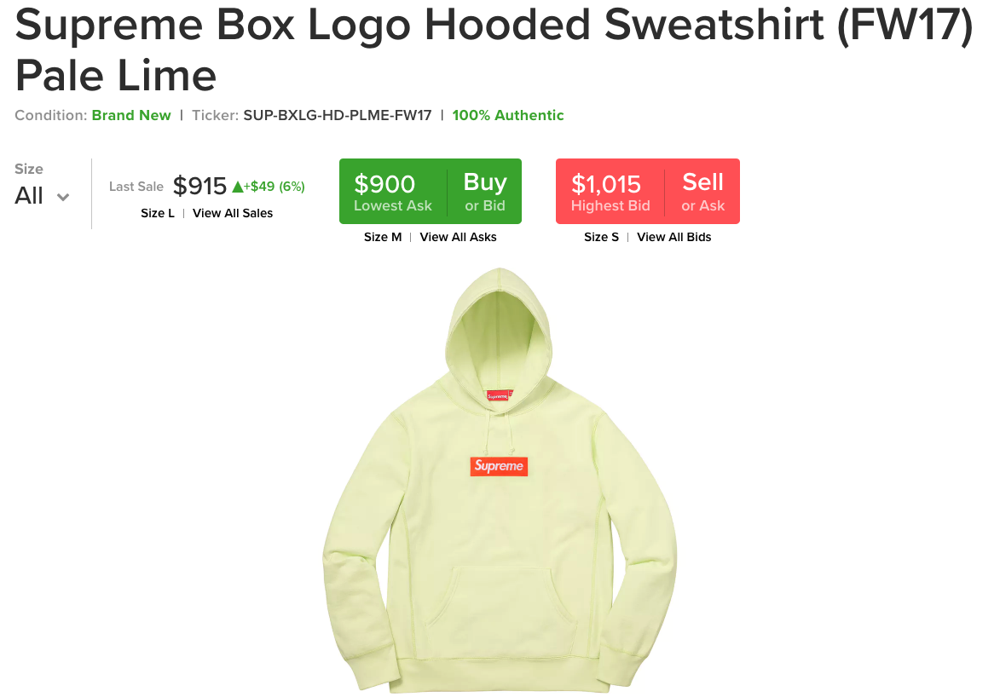

---

<!-- .slide: data-background="#ffffff" -->

---

220 $

---

350 $

---

<!-- .slide: data-background="#ffffff" -->

---

<!-- .slide: data-background="#ffffff" -->

---

240 $

---

450 $

---

<!-- .slide: data-background="#ffffff" -->

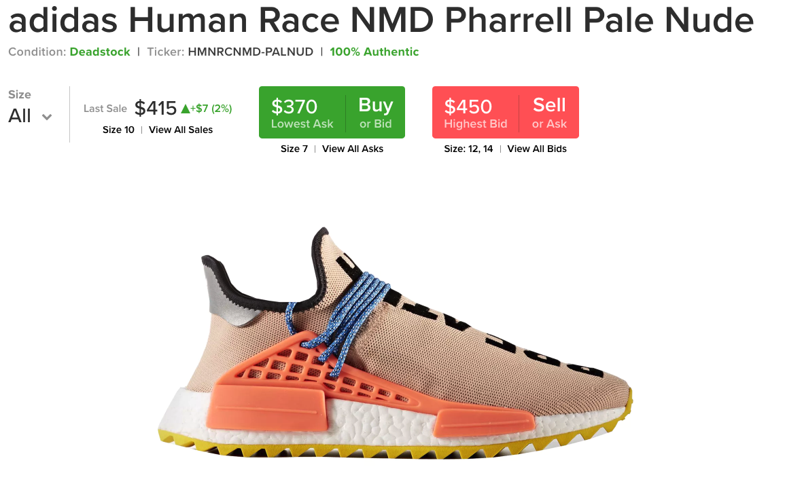

---

<!-- .slide: data-background="#ffffff" -->

---

160 $

---

550 $

---

<!-- .slide: data-background="#ffffff" -->

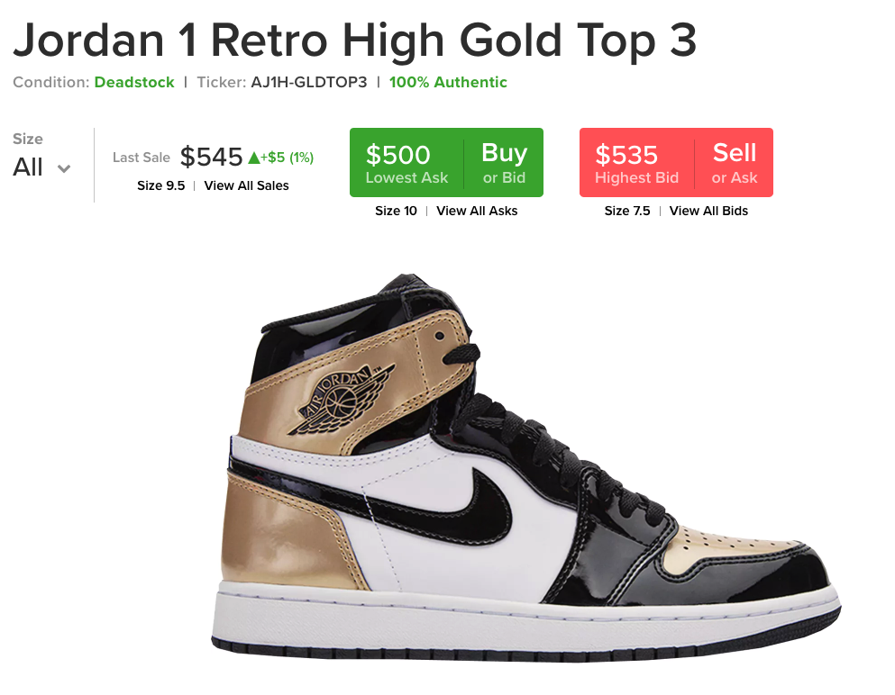

---

Profit

~ 2000 $

---

5 minutes

---

24.000 $ / hr

---

How?

---

bots

---

clustering, high-frequency...

---

node.js

---

mongodb

---

redis

---

docker

---

elasticsearch

---

logstash + kibana

---

tor

---

WAIT WHAT?

---

Javascript

---

Javascript === $

---

19

---

1999

---

* Rue montgallet
* Windows 98
* With Paul B.

---

Segmentation Fault

---

> WTF !!??!

### me

---

coding

===

knitting

---

Give me a R&D intership

---

> No !

---

> No ! But coding Yes

### Cac 40 companies

---

9y AIRBUS

---

C# and .NET

---

IMagery INTelligence

---

Application in browser

---

> WTF !!??!

### me

---

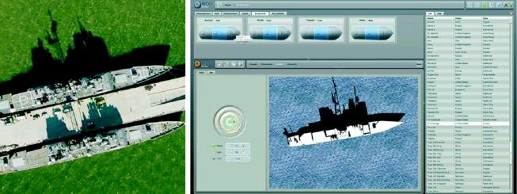

---

Syndrom

---

I wanna be a Project Manager

---

Give me a new payroll

---

Coding for Money

---

C, C++, Java, Ruby,
PHP, Python, Javascript...

---

92 Bond Street

---

* Android Apps
* Affiliation
* Bots
* iPhone re-selling
* t-shirts

---

Director of Front-End Engineering @synthesio

---

French startup

---

Social Media Intelligence

---

---

Success Stories and Unicorn

---

Uber, Airbnb, Snapchat, Dropbox, Spotify, Blabacar...

---

Web Application

---

Web Application Architecture(s)

---

Web Application Architecture(s)

---

Web

---

Internet ?

---

Information

---

51 %

7 billions in June 2017

---

* Device consumer
* Internet connection
* Open a browser with a specific website address

---

Application

---

App

---

* Search on google
* Send a message (Instagram, whatsapp...)
* Buy the last bestseller on Amazon

---

* Drive with waze
* Eat Otacos with uberEats

---

Desktop

---

* software
* program

---

Browser

---

Full interactive experience

---

New software ?

---

SAAS

---

Software As A Service

---

Website

---

Static

---

Passive eXperience

---

Resident WWW

---

Active

---

Single VS multi task

---

Data anywhere

---

My or not, devices

---

My or not, browser

---

Application up to date

---

Everywhere

---

PC, MAC, linux... ?

It does not matter

---

Safe

---

Browser

---

Architecture

---

types in a URL

---

click on "GO"

---

<!-- .slide: data-background="#ffffff" -->

---

(S)

---

n ways to build a webapp

---

Javascript Ecosystem

---

Personal commitment

---

Les 3 frères

---

HTML + CSS + JS

---

Javascript

---

The World Most Used Programming Language

---

Web app programming objectives

---

* Flexible
* Scalable
* Reusable
* Maintenable
* Readable

---

able

---

Programming language

---

Java, .Net, PHP, Ruby, Python, Go... etc

---

JavaScript is over

---

Every browsers support it

---

Browser and a text editor

---

No need SDK or Framework

---

Everything could be done

---

Trend industry in next years

---

Blockchain & fintech

---

Medical technology

---

AR/VR 

---

3D printing

---

AI

---

Drones

---

1995

---

by Brendan Eich (Netscape former)

---

LiveScript

JavaScript

---

Java

!==

JavaScript

---

Ecma International

---

Last major - ES6

---

Also ECMAScript 2015 (After 6 years of stability for ES5)

---

The World Most Misunderstood Programming Language

---

OO Programming

---

Objective

---

Be able to start an online business with a web application

---

Developers

---

Forget the guy with a pen in his shirt pocket

---

Control performance, SEO, time rendering, bug free, cross-browsing of a web application...

---

UX and UI are not buzzwords

---

User engagement

---

in a competitors world

---

Prototyping

Version 0.0 of your product

---

Has to work and looks beautiful

---

*Low cost* best practices

---

Vibrant

---

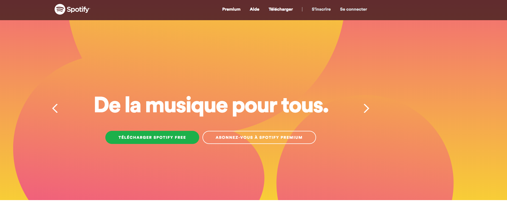

---

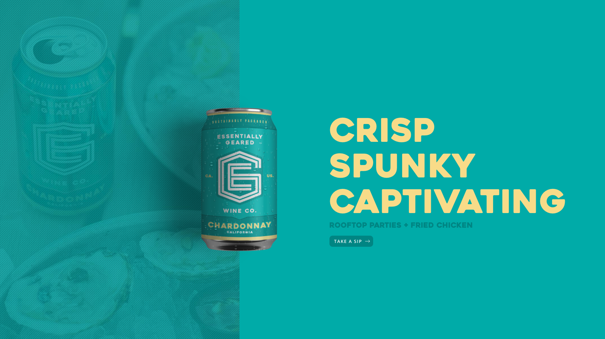

---

Mobile first

---

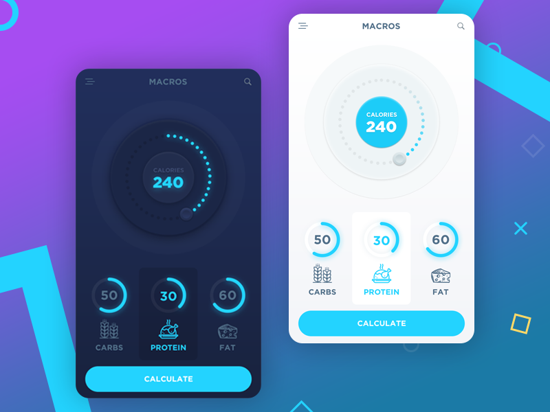

---

---

Custom illustrations

---

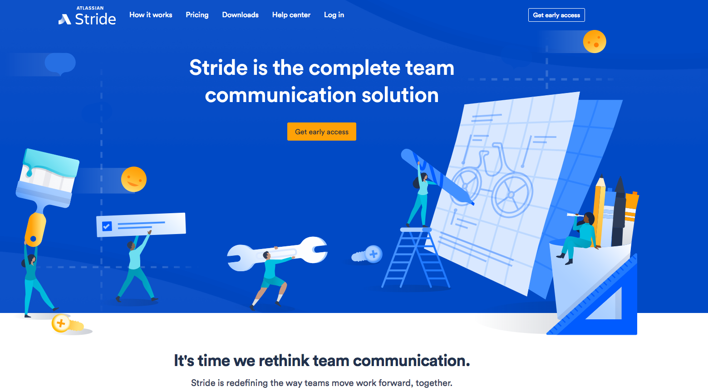

---

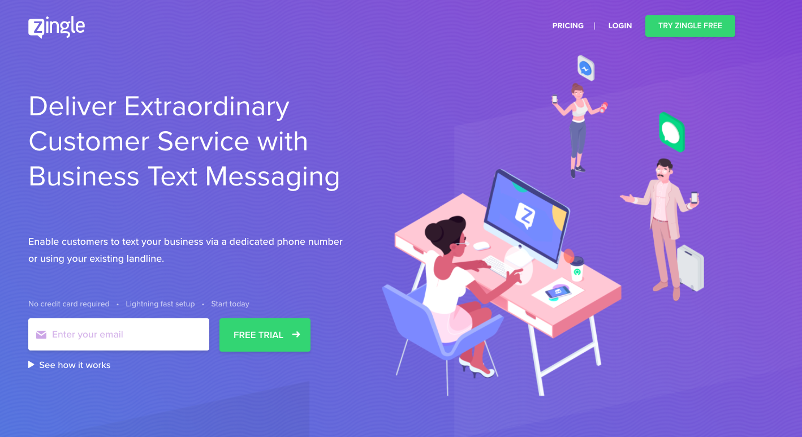

---

Notorious big

---

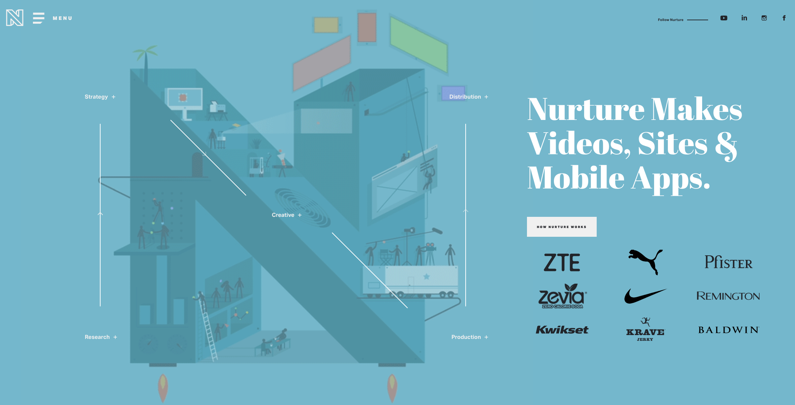

---

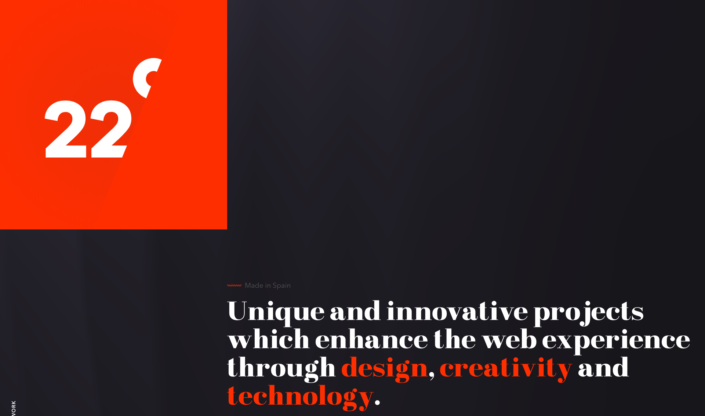

---

Tools

---

Artisan

---

Once found you can work faster and more efficient

---

Paper and pen

---

* Take notes
* Draw
* Cross Out
* Organize
* Plan your day

---

A good editor

---

A developer without editor is as a TV without colors: it doesnt make sense.

---

Terminal

---

9 courses

---

1) Javascript World Domination

---

2) Suit up your apps

---

3) Node.js, Master of Universe

---

4) React

---

React Native

---

React for IoT

---

React for AR/VR (with Oculus Rift leading the hiring charge)

---

React for obscure computing thing you’ve never heard of

---

5) Toolbox and Productivity

---

6) 3 Musketeers: RDD, CDD and TDD

---

7) API-ness

---

8) Progressive Web App, world of Hybrid

---

9) EcmaScript 2015 (ES6): the circle is now complete

---

Github

---

<a href="https://github.com/92bondstreet/javascript-empire" style="color:#fff">92bondstreet/javascript-empire</a>

---

yassine.azzout

@

gmail.com

---

Methodology

---

Useful links in 3 parts

---

* Must Read
* Must Watch
* Just tell me what to do

---

Must Read

Useful links to read as blog post

---

Must Watch

talk or podcast for passive context

---

Just tell me what to do

To be ready the workshop day

---

uncopyrighted

---

Make a milion dollars if you want

---

5h / w

---

2h

---

2h / d

---

14h / w

---

4 workshops

---

1) Online GPU renting

*2 sessions*

---

2) ...

*3 sessions*

---

3) RDD, CDD and TDD

*1 session*

---

4) AI / Blockchain / selling / monetizable

*3 sessions*

---

No marks

---

<!-- .slide: data-background="#2ECC40" -->

---

<!-- .slide: data-background="#FF851B" -->

---

<!-- .slide: data-background="#FF4136" -->

---

Works

---

Works

Well

---

On-time

---

as expected

---

* 20 / 15 / 10
* 15 / 10 / 5
* 10 / 5 / 0

---

Father of 2

---

Focus on the plan

---

Discord, Slack... ?

---

Questions ?

---

Thanks
